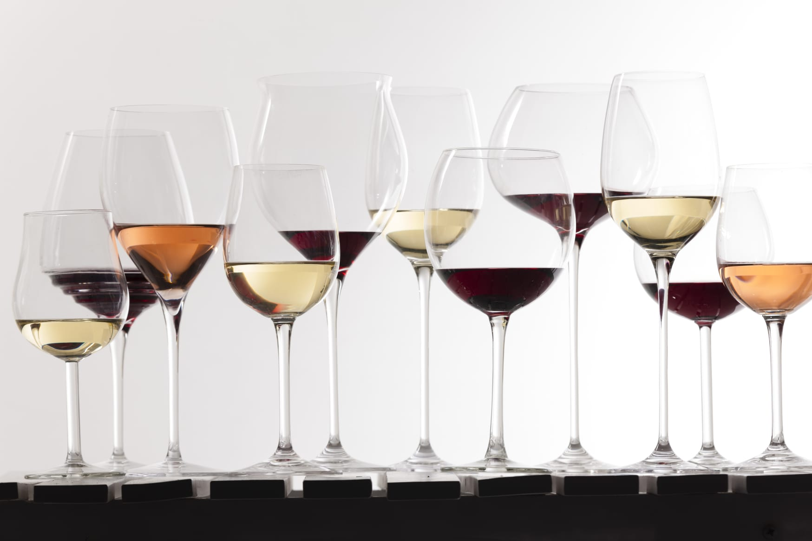

# Data Driven Insights of Wine Quality Data
---

# Table of Contents
1. Introduction
2. Prerequisites
3. File Description
4. Data
5. Results
6. Acknowledgements
7. Citation

# Introduction
In this repository, I shall be analyzing Wine Quality data from the North of Portugal. The aim of this project is to perform analyses on physicochemical attributes of data and answer the following questions which I constructed after initial assessment of the data:

1. Is a certain type of wine associated with higher quality?
2. What level of acidity receives the highest average rating?
3. Do wines with higher alcoholic content receive better ratings?
4. Do sweeter wines receive better ratings?
5. Is there a mapping between different range of quality ratings and type of wine?

# Prerequisites
1. Pandas (for data loading and analysis)
2. NumPy (for computing)
3. Matplotlib (for visualizations)
4. Seaborn (for visualizations)
5. Jupyter (to run notebooks)

# File Description
There are three folders:
1. Code
   - Wine Quality Analysis.ipynb- covers the entire analysis process performed to investigate both datasets as well as the documentation
2. Data
   - winequality-red: Red Wine Dataset
   - winequality-white: White Wine Dataset
   - winequality-edited: Master Dataset containing both red and white wine
3. Presentation
   - wine_quality_presentation.slides.html: Slideshow providing insights on questions
   - output_toggle.tpl: Template utilized for slideshow
   - presentation.gif: Preview of presentation
   
4. Images 
   - wine-image.jpg

# Data Overview
- There are total 12 attributes and 4898 observations in each dataset
- The input variables are a result of physicochemical tests:
    1. fixed acidity
    2. volatile acidity
    3. citric acid
    4. residual sugar
    5. chlorides
    6. free sulfur dioxide
    7. total sulfur dioxide
    8. density
     9. pH
    10. sulphates
    11. alcohol
- The output variables are based on sensory data:
  12. quality- score between 0 and 10 (median of at least 3 evaluations made by the wine experts)

# Results
1. Is a certain type of wine associated with higher quality?
      - The mean quality of red wine is less than that of white wine
2. What level of acidity receives the highest average rating?
   - Low level of acidity receives the highest mean quality rating
3. Do wines with higher alcoholic content receive better ratings?
   - Yes, wines with higher alcoholic content generally receive better ratings
4. Do sweeter wines receive better ratings?
   - Yes, sweeter wines generally receive higher ratings
5. Is there a mapping between a particular range of quality ratings and type of wine?
   - Yes. The lower ratings from 3-5 had more red samples than white. Whereas, as the quality ratings increased, white wines dominated more than red wine in the dataset.
# Acknowledgements
The datasets can be found [here.](https://archive.ics.uci.edu/ml/datasets/Wine+Quality)

# Citation
P. Cortez, A. Cerdeira, F. Almeida, T. Matos and J. Reis.
Modeling wine preferences by data mining from physicochemical properties. In Decision Support Systems, Elsevier, 47(4):547-553, 2009.
